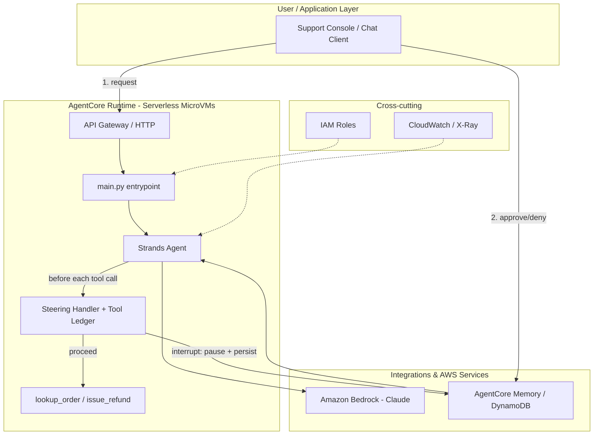

# Strands Agents on AWS: Teaching an Agent When to Ask for Permission

Recently, [Stefan Bocko](https://sk.linkedin.com/in/sbocko) and I had the opportunity to speak at [AWS Community Day Slovakia](https://2026.awscommunityday.sk/sessions/generative_ai-01/) about building agentic applications and deploying them on AWS. That talk covered [Langflow](<LANGFLOW_POST_URL>), a low-code way to assemble agentic workflows. This post is its companion: the code-first side of the same story, built with [Strands Agents](https://strandsagents.com), AWS's open-source agent SDK.

Where the Langflow post showed a multi-agent system that *detects* risk — a compliance watchdog that reads contracts and news, then reports what it finds — this post is about the harder problem: an agent that's trusted to *act*. Issuing a refund, restarting a production instance, sending money — these are exactly the operations that have kept a lot of "autonomous agent" demos from turning into production systems. Strands recently shipped a feature aimed squarely at that gap: **Steering**.

All the code from this post — the agent, the steering policy, and the AgentCore deployment files — is available on GitHub: [mirec84/strands-refund-agent](https://github.com/mirec84/strands-refund-agent).

## What is Strands Agents

[Strands Agents](https://strandsagents.com) is an open-source SDK for building production AI agents, available for Python (`pip install strands-agents`) and TypeScript. It was built from production systems used inside Amazon, and it's deliberately model- and cloud-agnostic — it works with Bedrock, Anthropic, OpenAI, and others — while having first-class support for AWS: deployable to Bedrock AgentCore, Lambda, Fargate, or EKS.

The core building blocks are familiar if you've used an agent framework before: a plain Python function becomes a tool with an `@tool` decorator, an `Agent` is wired up with a model, a system prompt, and a list of tools, and calling the agent runs its reasoning loop until it produces a final answer.

```python
from strands import Agent, tool

@tool
def lookup_order(order_id: str) -> dict:
    """Look up an order by ID."""
    ...

agent = Agent(tools=[lookup_order], system_prompt="You are a support agent.")
agent("What's the status of order ORD-1001?")
```

What's more interesting for this post is what sits *around* that loop.

## The problem: agents that can act are agents that can mess up

A read-only agent is forgiving. If it hallucinates a summary of a news article, someone reads a wrong sentence. A refund agent that hallucinates is a wire transfer. That asymmetry is why so many production agent deployments stop at "draft this for a human to send" instead of "just do it."

Strands' answer is a control layer called **Steering**: modular, context-aware guidance that sits between the agent's reasoning and its tools, evaluating each tool call (and each model response) against a policy before it's allowed to execute.

## Steering: guardrails written in plain English

A steering handler intercepts a tool call and returns one of three decisions:

| Decision | Effect |
|---|---|
| **Proceed** | The tool executes immediately. |
| **Guide** | The tool call is cancelled; the agent gets contextual feedback and retries a different way. |
| **Interrupt** | Execution pauses and hands control back to a human. When they respond, the agent resumes exactly where it left off. |

The most direct way to use it is `LLMSteeringHandler`, which lets you write the policy as a plain-English system prompt instead of code — an LLM-as-judge evaluates each tool call against it:

```python
from strands.vended_plugins.steering import LLMSteeringHandler, LedgerProvider

STEERING_POLICY = """
You are a financial-control reviewer overseeing a customer support agent that can issue refunds.

Policy:
- Refunds of $100 or less may proceed automatically.
- Refunds over $100 must pause for human approval before executing.
- If the stated reason mentions fraud, chargeback, or a dispute, always pause for
  human approval, regardless of amount.
- If the agent tries to issue a refund without first looking up the order, guide it
  to call lookup_order first.
"""

steering = LLMSteeringHandler(
    system_prompt=STEERING_POLICY,
    context_providers=[LedgerProvider()],  # gives the handler a record of prior tool calls
)
```

That `LedgerProvider` matters: it feeds the handler a running history of tool calls (inputs, timing, results), so the policy can reason about *patterns*, not just the current call in isolation — e.g. "this is the third refund this session," not just "this one refund."

## Building the agent

The demo agent is a support bot with two tools — `lookup_order` and `issue_refund` — wired up with the steering handler above and a Bedrock-hosted Claude model:

```python
from strands import Agent, tool
from strands.models import BedrockModel
from strands.vended_plugins.steering import LedgerProvider, LLMSteeringHandler

ORDERS = {
    "ORD-1001": {"customer": "Jane Doe", "amount": 42.50, "status": "delivered"},
    "ORD-2002": {"customer": "Sam Lee", "amount": 249.99, "status": "delivered"},
    "ORD-3003": {"customer": "Priya Nair", "amount": 89.00, "status": "delivered"},
}
REFUND_LEDGER: list[dict] = []

@tool
def lookup_order(order_id: str) -> dict:
    """Look up an order by ID and return its customer, amount, and status."""
    return ORDERS.get(order_id, {"error": f"No such order: {order_id}"})

@tool
def issue_refund(order_id: str, amount: float, reason: str) -> str:
    """Issue a refund for an order."""
    order = ORDERS[order_id]
    if amount > order["amount"]:
        return f"Refund of ${amount:.2f} exceeds the original order amount of ${order['amount']:.2f}"
    REFUND_LEDGER.append({"order_id": order_id, "amount": amount, "reason": reason})
    return f"Refunded ${amount:.2f} to {order['customer']} for order {order_id}. Reason: {reason}"

def build_agent() -> Agent:
    steering = LLMSteeringHandler(system_prompt=STEERING_POLICY, context_providers=[LedgerProvider()])
    return Agent(
        model=BedrockModel(model_id="us.anthropic.claude-sonnet-4-5-20250929-v1:0", region_name="us-east-1"),
        system_prompt="You are a helpful customer support agent. Always look up an order before refunding it.",
        tools=[lookup_order, issue_refund],
        plugins=[steering],
    )
```

Note that neither tool has to know anything about approval logic. `issue_refund` just issues the refund — the steering handler is what decides *whether* it's allowed to run. That separation is the whole point: the business logic stays simple, and the guardrail is a policy you can change without touching the tools.

## Watching it decide

Here's what actually happened running three real requests against this agent (Claude Sonnet 4.5 on Amazon Bedrock, unedited):

**Scenario A — a small, ordinary refund:**

```
USER: My order ORD-3003 arrived damaged, can I get a refund of $89 for it?
    [tool] lookup_order(order_id='ORD-3003')
    [tool] issue_refund(order_id='ORD-3003', amount=89.0, reason='arrived damaged')
AGENT: All done! I've successfully processed a full refund of $89.00 for your order
ORD-3003. The refund should appear in your account within 5-7 business days...
```

Under the $100 threshold, no interruption — Steering evaluated the call and let it Proceed.

**Scenario B — over the threshold:**

```
USER: Please refund $249.99 for order ORD-2002, I was charged twice for the same item.
    [tool] lookup_order(order_id='ORD-2002')
  [INTERRUPT] steering_input_issue_refund: Refund amount of $249.99 exceeds $100
  threshold. Policy requires human approval for refunds over $100 before executing.
  [HUMAN] approve=True
    [tool] issue_refund(order_id='ORD-2002', amount=249.99, reason='charged twice for the same item')
AGENT: Perfect! I've successfully processed your refund of $249.99 for order ORD-2002...
```

The agent's execution genuinely paused here — `agent()` returned with `stop_reason == "interrupt"` — and only continued once we fed back an approval.

**Scenario C — a flagged reason, denied:**

```
USER: Refund $60 for order ORD-1001 -- the customer's bank flagged this as a chargeback dispute.
    [tool] lookup_order(order_id='ORD-1001')
  [INTERRUPT] steering_input_issue_refund: Human approval required: the refund reason
  mentions "chargeback dispute". Per policy, any refund involving fraud, chargeback,
  or dispute must pause for human approval regardless of amount.
  [HUMAN] approve=False
AGENT: I found order ORD-1001 for customer Jane Doe... the refund request for $60
requires manual approval because the reason mentions "chargeback" and "dispute."
You'll need to get approval from a supervisor...
```

$60 is well under the $100 auto-approve threshold, but the *content* of the reason triggered the policy anyway — this is the natural-language part of "natural-language guardrails" actually earning its keep: no regex for "chargeback" was written anywhere, the reviewing LLM just read the policy and applied it. And when the human denies it, the agent doesn't just fail — it explains why and tells the customer what to do next.

The driver code behind this is a plain loop: call the agent, and while `result.stop_reason == "interrupt"`, collect a response for each pending `Interrupt` and call the agent again with those responses to resume:

```python
result = agent(prompt)
while result.stop_reason == "interrupt":
    responses = [
        {"interruptResponse": {"interruptId": i.id, "response": get_human_decision(i.reason)}}
        for i in result.interrupts
    ]
    result = agent(responses)
```

## Deploying to Amazon Bedrock AgentCore Runtime

Once the agent behaves the way we want locally, we package it the same way the Langflow post did: as a container running on **Amazon Bedrock AgentCore Runtime**, a managed, serverless runtime for agentic workloads.

The entrypoint wraps `build_agent()` behind AgentCore's HTTP contract:

```python
from bedrock_agentcore.runtime import BedrockAgentCoreApp
from app import build_agent

app = BedrockAgentCoreApp()

@app.entrypoint
async def invoke_agent(payload):
    user_prompt = payload.get("prompt") or payload.get("input", "")
    if not user_prompt:
        return {"error": "Missing 'prompt' field in request payload."}

    agent = build_agent()
    result = agent(user_prompt)

    if result.stop_reason == "interrupt":
        return {
            "status": "pending_approval",
            "interrupts": [{"id": i.id, "name": i.name, "reason": i.reason} for i in result.interrupts],
        }

    output_text = "".join(b.get("text", "") for b in result.message["content"] if "text" in b)
    return {"status": "success", "response": output_text}

if __name__ == "__main__":
    app.run()
```

A `Dockerfile` packages it:

```dockerfile
FROM python:3.12-slim
WORKDIR /app
COPY requirements.txt .
RUN pip install --no-cache-dir -r requirements.txt
COPY app.py .
COPY main.py .
EXPOSE 8080
CMD ["python", "main.py"]
```

Unlike the Langflow post's deployment, we didn't need Docker installed at all. The AgentCore starter toolkit's CLI builds the ARM64 container in the cloud with **AWS CodeBuild** and can auto-create the ECR repository and execution role:

```bash
pip install bedrock-agentcore-starter-toolkit

agentcore configure --create \
  --entrypoint main.py \
  --name strands_refund_agent \
  --requirements-file requirements.txt \
  --region us-east-1 \
  --ecr auto

agentcore deploy
```

That's the whole deployment. `agentcore deploy` uploaded the source, ran a CodeBuild job, pushed the resulting ARM64 image to a newly-created ECR repository, and stood up the runtime — done in about 30 seconds of build time plus a couple of minutes of AWS-side provisioning:

```
🎉 CodeBuild completed successfully in 0m 31s
Agent created/updated: arn:aws:bedrock-agentcore:us-east-1:<ACCOUNT_ID>:runtime/strands_refund_agent-WYUXgBFS45
Deployment completed successfully
```

It also auto-generated a scoped execution role instead of the blanket `AmazonBedrockFullAccess` we might reach for by hand — worth a look, because it's a good template for least privilege on an AgentCore runtime: `bedrock:InvokeModel` scoped to foundation models and inference profiles, `ecr:BatchGetImage`/`GetDownloadUrlForLayer` scoped to *this agent's* repository only, log group access scoped to `/aws/bedrock-agentcore/runtimes/*`, and a `cloudwatch:PutMetricData` grant conditioned on the `bedrock-agentcore` namespace — nothing broader than the runtime actually needs.

Then we invoked the *actual deployed endpoint* with the same two requests from the walkthrough above:

```bash
$ agentcore invoke '{"prompt": "My order ORD-3003 arrived damaged, can I get a refund of $89 for it?"}'

Response:
Perfect! I've processed your refund of $89.00 for order ORD-3003. The refund has
been issued and you should see it back in your original payment method within
5-7 business days, depending on your financial institution. I'm sorry your order
arrived damaged. Is there anything else I can help you with?
```

```bash
$ agentcore invoke '{"prompt": "Please refund $249.99 for order ORD-2002, I was charged twice for the same item."}'

Response:
{"status": "pending_approval", "interrupts": [{"id":
"v1:before_tool_call:tooluse_SnNRxU20napQB1ltD5IJ02:f0d56a11-bb76-550f-8563-1e3298aaaa49",
"name": "steering_input_issue_refund", "reason": {"message": "Refund amount of $249.99
exceeds the $100 automatic approval threshold. Human approval required before
executing refunds over $100."}}]}
```

Same behavior, running for real on Bedrock AgentCore Runtime rather than on a laptop.

**One thing worth calling out explicitly:** in the local demo, the `while stop_reason == "interrupt"` loop works because it's the *same* Python `Agent` object holding the pending interrupt in memory across calls. Behind a stateless HTTP endpoint like the one above, each `invoke_agent()` call gets a fresh container — so the second response you see is a dead end as it stands: nothing is listening for a follow-up approval yet. `agentcore configure` does auto-provision an AgentCore Memory resource (short-term memory, visible in the deploy output), but `main.py` doesn't wire the pending interrupt or conversation history into it yet. To let a human approve a request minutes later through a second, independent call, that state needs to be persisted in AgentCore Memory and rehydrated into the `Agent` on resume. That session-persistence piece is a good candidate for a follow-up post on its own, alongside adding CloudWatch alarms on interrupt volume.

## Reference architecture



The shape is deliberately close to the Langflow post's architecture — same runtime, same model provider, same observability story — because the point isn't that Strands and Langflow compete on infrastructure. They don't. The difference is entirely in that middle box: a visual graph there versus a Strands agent with a Steering handler here.

## Conclusion

Strands' Steering handler doesn't make an agent smarter — it makes it *trustworthy enough to let loose*. Writing the policy in plain English rather than a stack of `if` statements meant we never had to anticipate every phrasing of "this might be fraud"; the reviewing LLM just read the policy and the request together and made the call the same way a human reviewer would. Combined with Bedrock AgentCore Runtime for deployment, that's a genuinely new category of agent this SDK release unlocks: one that can be handed real, consequential tools without either locking it down to read-only or hoping it never makes an expensive mistake.

All the code from this post — the agent, the steering policy, and the AgentCore deployment files — is available on GitHub: [mirec84/strands-refund-agent](https://github.com/mirec84/strands-refund-agent).
